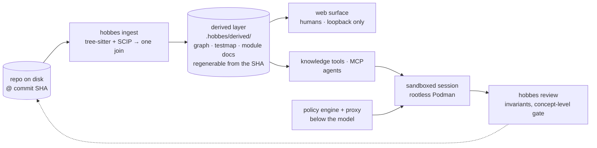
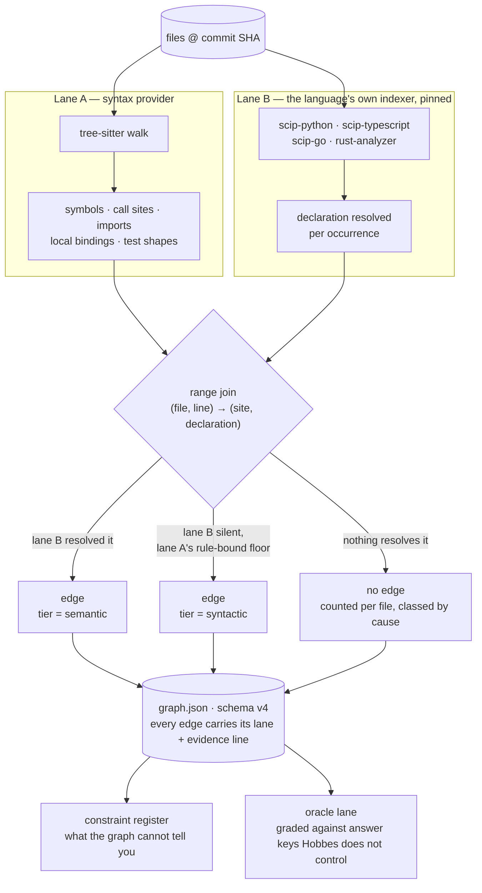
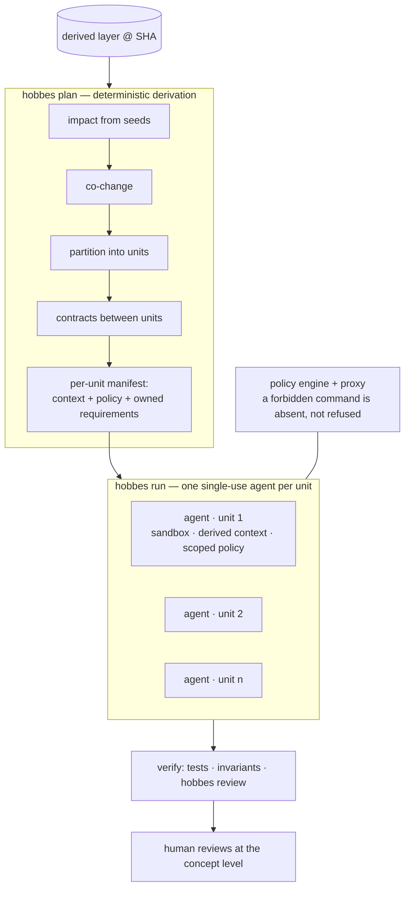

# Hobbes

**Hobbes** is named for the tiger in Bill Watterson's *Calvin and Hobbes*,
and it tries to be what Hobbes is in the strip: the companion who goes
along with the ambitious idea, tells you the truth about it, and is
still there when the wagon goes off the cliff. In software terms it is a
**multilingual, deterministic code graphing environment** — it reads a
repo, builds an accurate map of it, and uses that map to give agents
safe, well-scoped context and to give people a system they can actually
understand and review.

The reason it exists is trust. More and more code is written by agents
and reviewed by nobody in particular, and a tool that helps with that
is only worth having if you can believe what it tells you. So Hobbes is
built around three properties, in order:

- **Accurate** — a graph that is wrong is worse than no graph, because
  it gets believed.
- **Deterministic** — parsers and indexers build the skeleton, never a
  model. Same commit in, same artifacts out.
- **Honest** — determinism promises the same answer twice, not a true
  one. So every edge says which tool proved it, every limit is written
  down where you will meet it, and the blind spots of the third-party
  indexers Hobbes runs are owned as Hobbes's own.

Faster agents may fall out of this — an agent handed the right twelve
files does less wandering — but speed is a side effect, not the goal.
The goal is an environment developers can trust: context that is safer
for the agent to work from, and a system that is easier for a person to
understand.

Hobbes is built on other people's work and says so: **tree-sitter** is
every syntax lane, the **SCIP** protocol and its indexers
([scip-code/scip](https://github.com/scip-code/scip)) are every semantic
edge, and the graph is graded against compilers and interpreters Hobbes
does not control. The full list is under
[Acknowledgements](#acknowledgements--what-hobbes-is-built-on).

The comic — *Calvin and Hobbes*, by Bill Watterson — is a wonderful
masterpiece, and everyone should read it at least once. Anyone is welcome
to use Hobbes; the only request is that you keep some reference to the
funny tiger in your uses of it.

Also worth checking out- https://calvinandhobbes.webflow.io/


<sub>*Calvin and Hobbes* © Bill Watterson. Used here in affection, not ownership.</sub>

---

## What it does

Point Hobbes at a repo and it builds a **derived layer** — a typed graph
of modules and symbols, a map from tests to the code they exercise, and
module docs pinned to a commit — and then serves that one set of
artifacts to two audiences: a web surface for people and an MCP tool
server for agents. Agents work inside rootless Podman sandboxes with a
Go policy engine sitting below the model, so what an agent may run is
decided by the operating system and a proxy rather than by a prompt.



A few ideas carry most of the weight:

- **The repo stays canonical.** Everything in `.hobbes/derived/` is
  regenerable from a commit SHA. Nothing derived is hand-maintained.
- **One knowledge layer, two renderers.** The same artifacts serve the
  UI and the agent tools, so what the person sees and what the agent is
  told never drift apart.
- **Provenance on every claim.** Narrative statements cite `file:line @
  SHA`; graph edges cite the lane and the evidence that produced them.
- **Policy is enforced below the model.** Rules in a prompt are advisory;
  the sandbox and the tool proxy are what actually hold.
- **Degrade visibly, and write down what you cannot know.** A failed
  indexer leaves the graph standing at lower confidence and says so. A
  limit that is structural gets an entry in the constraint register,
  [`docs/constraints/`](docs/constraints/README.md), naming where a user
  will meet it.
- **A provider's limits are Hobbes's limits.** Semantics come from
  third-party indexers Hobbes runs and does not wrap. Their blind spots
  land in the graph, so they are recorded as *ours*.

Deeper: [`docs/hobbes-architecture.md`](docs/hobbes-architecture.md) is
the running architecture and the source of truth;
[`docs/first-run.md`](docs/first-run.md) is the first hour on a new repo.

## Extraction is two lanes

This is the part most worth understanding, because it is where the
accuracy comes from. **tree-sitter** knows that a call site *is* a call
and where it sits; the language's own **SCIP indexer** (`scip-python`,
`scip-typescript`, `scip-go`, `rust-analyzer`'s native export) knows what
an occurrence *resolves to*. Neither is asked a question it would have
to guess at. The two meet on file:line ranges before any graph exists,
so an edge is a call *because* tree-sitter saw one and points where it
points *because* the indexer resolved it.



Both halves are needed, and that was measured rather than assumed: no
SCIP indexer records what a reference syntactically *was* (`scip-python`
leaves the field unset for 0 of 8,575 occurrences, `scip-go` for 0 of
18,682, `rust-analyzer` for 0 of 169). Without the syntax lane a
language gets references and no call graph at all. That is why adding a
language means a grammar *and* an indexer — and why, once both exist, a
language is configuration: Rust arrived with zero new lines in the graph
builder, the join, or the schema.

Every edge carries a **tier** — `semantic` (the indexer proved it),
`syntactic` (lane A's own labelled floor), `dynamic` (reserved) — and
readers treat the tier as trust: a violation found on semantic edges is
a finding, on syntactic edges a suspicion, and the reviewer says which.
A site that nothing resolves is **not an edge**; it is counted in the
file's resolution coverage and classed by cause, so "how much did you
miss" is always answered next to "what did you find".

Then the graph is graded, per language, against something Hobbes does
not control — Go against `x/tools` RTA, TypeScript against `tsc`, Python
against the interpreter running the repo's own test suite, Rust against
rustc's MIR — with wrong edges deliberately seeded on every cell to
prove the grader can say no. Every compiler-graded semantic tier is at
100% on the cells graded so far; every miss falls into one known class
(closures, function values, interface dispatch) and is written down.

Deeper: architecture §3;
[`docs/extraction-evidence.md`](docs/extraction-evidence.md) (every repo
it has been run on, with numbers);
[`docs/oracle-grading.md`](docs/oracle-grading.md) with
[`docs/oracle-misses.md`](docs/oracle-misses.md) and
[`docs/oracle-defects.md`](docs/oracle-defects.md) (the grading, the
misses by class, the grader's own mistakes);
[`docs/constraints/`](docs/constraints/README.md) (the register).

## Where this is going

An accurate map of a repo is useful on its own. What Hobbes wants to do
with it is make the agent workflow something a developer can trust.

Anyone who has run an agent for a while has seen the drift: it is sharp
on the first task and confidently wrong by the fifth, still fluent,
working from a window that is now mostly its own earlier output. The
usual fixes — a bigger window, a firmer prompt — ask the model to be
careful. Hobbes takes a different route: if you know the repo's real
structure, you can derive, *per task*, the context that task actually
needs and the policy it is actually permitted, start one agent inside
both, and let it end when the task does. The agent gets a smaller, truer
picture; the person gets a unit of work whose scope, inputs, and
permissions were written down before it started.



The policy half is what makes this safe rather than merely tidy, and it
is why the sandbox sits below the model instead of inside it. A rule in
a prompt is a request. A command outside the policy is not refused — it
is *absent*: no binary on the path, no mount to write through, no route
to the network. An agent that cannot be talked out of its constraints
does not need to be trusted, which is the only kind of agent worth
handing a repo to.

All four pieces exist: a graph accurate enough to derive from,
invariants that make the result checkable (`hobbes review`), enforcement
that is real rather than advisory (rootless Podman plus the Go policy
engine and proxy), and the derivation itself (`hobbes plan` /
`hobbes run`, ADR-051/054). Whether it *helps* — whether a small open
model under derived context does better than the same model unaided —
is being measured with `hobbes bench`, and honestly: so far the
measuring has produced corrections rather than a result. The per-unit
write partition can fence a model below a multi-file fix (ADR-077);
SWE-bench Verified turned out to be contaminated (C-39), so the
benchmark is moving to DeepSWE 1.1. No claim that derived context
substitutes for model size has been earned yet, and this README will say
so until one is.

Deeper: architecture §6;
[`docs/benchmark-hypotheses.md`](docs/benchmark-hypotheses.md) (the
preregistered claims and every run's result);
[`docs/benchmark-deepswe.md`](docs/benchmark-deepswe.md) (the redirect);
[`docs/adr085-validation-run.md`](docs/adr085-validation-run.md) (the
latest run and its defect register).

## Related projects

Code graphs for agents are having a moment, and rightly so: as fewer
people read every line an agent writes, a structural map of the repo is
the thing that keeps the work reviewable at all.
[CodeGraphContext](https://github.com/CodeGraphContext/CodeGraphContext)
and [repowise](https://github.com/repowise-dev/repowise) are two good
examples of the shape — a graph over a repo, MCP tools, no model in the
build — and they are worth knowing as context for what Hobbes is.

Most of the field describes itself in terms of making agents better.
Hobbes leans the other way: it is about making the context an agent
works from *safer*, and the system a person is responsible for *easier
to understand*. Where the structures part — indexers that are mandatory
and pinned, joined against the syntax lane with the tier recording which
one spoke; a register of what the graph cannot say; cells graded by
compilers; context derived per task inside a governed sandbox rather
than served as a tool menu — is laid out with diagrams and per-cell
numbers in [`docs/how-hobbes-differs.md`](docs/how-hobbes-differs.md).

## Status

**v1 (M0–M8) and v2 extraction (V2.M0–M7) are complete and reviewed.**
Semantic edges for **Python, TypeScript/JavaScript, Go and Rust** (plus
Terraform/HCL structure), graph schema v4 with tiers and evidence lanes,
framework knowledge in removable enrichment packs, a tier-aware invariant
checker, and a lane-agreement self-test — 3,085 call sites on this repo
with zero disagreements at the v2 exit; 36,703 dual-resolved sites on the
~265k-site dagger monorepo with 258, all but one a single known
line-convention off-by-one. The constraint register holds fifty-seven
entries, each naming where a user meets the limit. One worth knowing
before you ingest strangers' code: **indexing a Rust repo executes its
`build.rs` and proc macros** (C-29 — disclosed on stderr at every Rust
ingest).

**The oracle lane (ADR-089) has run both phases** — Go and TS
compiler-graded, Python trace-graded, Rust MIR-graded — with every
compiler-graded cell at 100% after ADR-090 and the misses registered by
class.

**The derivation programme is built and under test.** The latest run (the
ADR-085 validation pair, 7B, 2026-08-24) mostly held, solved 0/5 (not the
measure), and registered eight harness defects; those are the current
worklist. The benchmark is moving to DeepSWE 1.1 on a mini-swe-agent
substrate.

Current detail lives in [`docs/session-handoff.md`](docs/session-handoff.md)
(the resume point) and [`CLAUDE.md`](CLAUDE.md) (the contributor entry
point); the session-by-session record is
[`docs/BUILDLOG.md`](docs/BUILDLOG.md).

## The design docs

| Document | What |
|---|---|
| [`docs/hobbes-architecture.md`](docs/hobbes-architecture.md) | **Source of truth — the running architecture.** Describes Hobbes as it is now; amended in place, in the same commit as the code that moves it |
| [`docs/hobbes-build-plan-v2.md`](docs/hobbes-build-plan-v2.md) | The v2 programme, V2.M0–V2.M7, complete — kept with its exit criteria and outcomes |
| [`docs/hobbes-architecture-v1.md`](docs/hobbes-architecture-v1.md) | The frozen v1 design — history, kept for the reasoning behind the carried subsystems |
| [`docs/hobbes-build-plan.md`](docs/hobbes-build-plan.md) | v1 milestones M0–M8 and the locked decisions |
| [`docs/adr/`](docs/adr/) | 90 numbered ADRs — one per decision the running architecture doesn't make |
| [`docs/constraints/`](docs/constraints/README.md) | **What Hobbes cannot tell you**, one file per subsystem segment, and where you find that out |
| [`docs/oracle-grading.md`](docs/oracle-grading.md) | The oracle lane — the graph graded per language against compilers and the interpreter; misses in `oracle-misses.md`, the grader's own defects in `oracle-defects.md` |
| [`docs/how-hobbes-differs.md`](docs/how-hobbes-differs.md) | Hobbes beside CodeGraphContext and repowise — the structural differences, with diagrams and per-cell numbers |
| [`docs/first-run.md`](docs/first-run.md) | Bringing Hobbes up on a new app, in the order the system is meant to be used |
| [`docs/future_additions.md`](docs/future_additions.md) | Deliberately deferred work, with the reasoning kept |
| [`docs/benchmark-hypotheses.md`](docs/benchmark-hypotheses.md) | The preregistered benchmark claims and every run's results, including the contamination finding |
| [`docs/benchmark-deepswe.md`](docs/benchmark-deepswe.md) | The redirect to DeepSWE 1.1 (Pier + mini-swe-agent) and why |
| [`docs/session-handoff.md`](docs/session-handoff.md) | The single forward-looking resume point for a fresh session |
| [`docs/workstreams.md`](docs/workstreams.md) | The backlog grouped into assignable workstreams, with gating and contributor profiles |

Three decisions are settled and not revisited: Python + Go + TS split
by focus, Podman rootless for session isolation, Cytoscape.js for the
interactive graph.

## Layout

| Path | What | Language |
|---|---|---|
| `go/` | Policy engine, session tool proxy + flight recorder, sandbox launcher, and the web surface server | Go (≥1.26) |
| `pipeline/` | Extractors, the two-lane join, invariant compiler, review, and the `hobbes` CLI | Python (uv) |
| `web/` | Human surface — five-tab SPA, embedded into `hobbes-web` | TypeScript + React |
| `tsextract/` | TS/JS syntax provider (ts-morph), invoked as a subprocess | Node |
| `scip/` | Lane B — the pinned SCIP indexers and the facts helper | Node |
| `sandbox/` | Session container image and the exit-check harness | Containerfile + Python |
| `docs/` | Source docs, ADRs, the constraint register, and the append-only BUILDLOG | — |
| `.hobbes/` | Hobbes dogfooding itself: `policies/` and `invariants/` versioned, `derived/` gitignored | — |

## Getting started

Go, uv and Node are expected on `PATH`. `go.mod` needs **Go ≥ 1.26**, so a
user-local install must come before any distro Go.

```sh
# one-time
cd go   && go build -o bin/hobbes-policy  ./cmd/hobbes-policy \
        && go build -o bin/hobbes-web     ./cmd/hobbes-web \
        && go build -o bin/hobbes-session ./cmd/hobbes-session \
        && CGO_ENABLED=0 go build -o bin/hobbes-proxy ./cmd/hobbes-proxy
cd ../web && npm install && npm run build   # then rebuild hobbes-web
cd ../tsextract && npm install              # TS/JS extraction
cd ../scip      && npm install              # lane B indexers
cd ../pipeline  && uv sync

# per-language, only if your repos need them:
go install github.com/scip-code/scip-go/cmd/scip-go@v0.2.7   # Go semantics
rustup component add rust-analyzer                           # Rust semantics
```

> `hobbes-proxy` **must be statically linked** — `hobbes-session` mounts it
> into the sandbox, where a dynamic binary fails as a confusing
> `No such file or directory` (the loader is missing, not the binary).

Then, in the repo you want to work on:

```sh
hobbes up          # init if needed, re-ingest if stale, serve, and hold
                   # until you have settled intent and invariants
```

That is the whole first run. [`docs/first-run.md`](docs/first-run.md)
walks the same path step by step and explains what each one is *for*.

### The commands

```sh
hobbes init                    # scaffold .hobbes/ in a repo
hobbes ingest                  # run the extractors -> .hobbes/derived/*.json
hobbes lanes                   # where the two extraction lanes disagree (exit 1)
hobbes render > graph.mmd      # module graph as Mermaid
hobbes diff main..HEAD         # architecture delta between two refs
hobbes narrate                 # module docs + behaviors (spends Claude quota)
hobbes docs status             # which narrative artifacts are stale
hobbes invariants check        # validate .hobbes/invariants/
hobbes invariants compile      # -> import-linter / dep-cruiser / semgrep / rego
hobbes review main..HEAD       # concept-level gate (exit 1 if it needs you)
hobbes policy resolve "cmd"    # ask the Go engine what a command may do

hobbes plan "proposal"         # derive a change-spec (units, contracts, per-unit context)
hobbes run <task>              # spawn a sandboxed derived-context agent per unit
hobbes bench run insts.jsonl   # Hobbes-as-harness vs the same model unaided (ADR-055)

hobbes-web serve --repo .      # the surface, loopback only, port 7777
hobbes-session start --repo . --role implementer   # sandboxed agent session
```

`hobbes ingest && hobbes lanes && hobbes review $BASE..HEAD` is the CI
shape: extract, let the lanes check each other, then gate on the concepts.

## Tests

```sh
cd go        && go test ./...     # 291 cases across 12 packages
cd pipeline  && uv run pytest     # 911 cases
cd web       && npm test          # 52 vitest cases (the pure layer)
cd tsextract && npm test          # 29 node --test cases
cd scip      && npm test          # 25 node --test cases
```

Tests accompany the code they test in the same commit; the pytest suite
runs lane-A-only by default (`HOBBES_SCIP=0`) so it stays hermetic and
fast, which also means the degraded path is exercised on every run.

## Acknowledgements — what Hobbes is built on

Honesty is the third property, and it starts with credit. Hobbes's own
contribution is the *join* and what sits on it — the two-lane evidence
IR, the graph, the policy engine and proxy, the derivation, the
harness. The things it joins are other projects', used as they are and
pinned where a pin is possible:

- **[tree-sitter](https://tree-sitter.github.io/)** and its grammars
  (`tree-sitter-python`, `-go`, `-rust`, `-hcl`; pinned `<0.26` in
  `pipeline/pyproject.toml`) — **lane A, every language.** tree-sitter
  is how Hobbes knows a call site *is* a call and where it sits; every
  `syntactic` edge and every call-site count in this repo's evidence
  tables is a tree-sitter walk. Architecture §3.1.
- **[SCIP](https://github.com/scip-code/scip)** and the indexers Hobbes
  runs unchanged — `scip-python`, `scip-typescript`,
  [`scip-go`](https://github.com/scip-code/scip-go) (0.2.7), and
  `rust-analyzer`'s native `scip` export — **lane B.** Every `semantic`
  edge is theirs; their limits are registered as Hobbes's own (P9,
  C-6, C-23). Architecture §3.2.
- **[ts-morph](https://ts-morph.com/)** (over the TypeScript compiler)
  — the TS/JS syntax provider in `tsextract/` (ADR-021).
- **[mini-swe-agent](https://github.com/SWE-agent/mini-swe-agent)** and
  **[datacurve-pier](https://github.com/datacurve/pier)** — the
  **referenced open harness** both benchmark arms run in on the DeepSWE
  path (ADR-078/079/080). The *model + prompt* baselines Hobbes
  compares against are mini-swe-agent trajectories; Hobbes injects its
  aid through Pier's prompt-template seam and ships a small wrapper
  (`hobbesmini`) into Pier's image. A Hobbes *test*, by P12, is the
  decomposed run — but the baseline it is measured against is theirs.
- **[SWE-bench](https://www.swebench.com/)** / SWE-bench Verified and the
  pinned `swebench` 5.0.2 evaluator (the verdict, C-40), and
  **DeepSWE 1.1** (the uncontaminated set with a behaviour verifier the
  programme moved to, C-39).
- **Qwen** (Qwen2.5-Coder, Qwen3.8) served with **vLLM** on **Modal** —
  the small-model ladder (ADR-056/057/074).
- **The oracle lane's answer keys** (`bench/oracle/`, ADR-089) — the
  graph is graded against tools Hobbes does not control, and the grade
  is only as good as they are: **[`golang.org/x/tools`](https://pkg.go.dev/golang.org/x/tools)**'s
  `callgraph/rta` for Go; the **TypeScript compiler** (`tsc`'s own
  resolution) for TS; **CPython's `sys.monitoring`** (PEP 669) driving
  the repo's own pytest suite for Python; and **rustc itself** — the
  Rust oracle is a `rustc_driver` program linking rustc's private crates
  on a pinned nightly (`rustc-dev`), walking the MIR the compiler built.
  Each cell records the exact oracle version; a different nightly is a
  different oracle and the record says so.
- **The invariant compile targets** — `hobbes invariants compile` emits
  configuration for **[import-linter](https://github.com/seddonym/import-linter)**,
  **[dependency-cruiser](https://github.com/sverweij/dependency-cruiser)**,
  **[semgrep](https://semgrep.dev/)** and **[OPA](https://www.openpolicyagent.org/)**
  (Rego); those tools do the enforcing in CI, Hobbes only writes the
  rules down in their language.
- **[Cytoscape.js](https://js.cytoscape.org/)** (D3) for the
  interactive graph, with **React** and **Vite** around it; **Podman**
  rootless (D2) for session isolation on an **Alpine** base image; the
  **Model Context Protocol** Go SDK and `yaml.v3` — the only external
  Go dependencies of the product binaries.
- And **Bill Watterson**, for the tiger. Hobbes takes its name — and
  its temperament — from *Calvin and Hobbes* (1985–1995), the comic
  strip this project is unreasonably fond of. It gets the last word in
  this list on purpose: read the strip.

## License

MIT — see [`LICENSE`](LICENSE). Keep a reference to the beloved tiger, HOBBES!!
