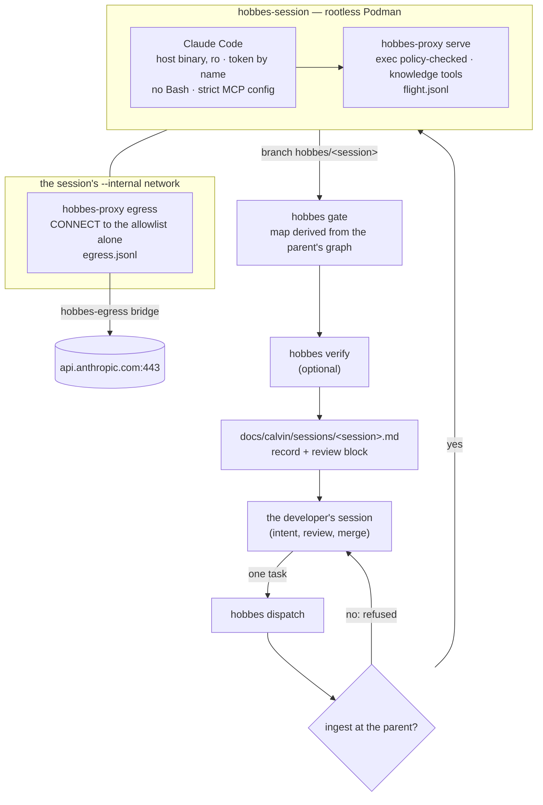

# Calvin as a harness — the environment stacked under the doer, validated by use

**Status:** built 2026-09-12 (Hobbes 0.1.21-beta, ADR-107). Validation opens with the first dispatched session, whose log lands in [`sessions/`](sessions/README.md). **Retention amended the same day (0.1.22-beta):** the doer's reasoning is never stored, and recorded sessions are evaluation rows, never model training data (the retention section below).
**Supersedes, as an approach:** the keyed rounds. Their records stand as history:
- M0 ([`calvin-potential.md`](calvin-potential.md));
- M0-Go ([`calvin-m0-go.md`](calvin-m0-go.md), [`calvin-m0-go-r2.md`](calvin-m0-go-r2.md));
- M0-Gate ([`calvin-m0-gate.md`](calvin-m0-gate.md)).

**The role is unchanged:** [`calvin-charter.md`](calvin-charter.md) still says what Calvin is for.

## 1. Why the approach changed

Three rounds measured Calvin as an experiment: keys, arms, readings
written before the spend, and a gate at each spend. They spent about
$27, and the approach did not validate itself.

- M0-Go found no floor at A2.
- M0-Gate found a floor as a safety property, not a helper, on ten
  keys.
- Every round found a defect in its own instrument:
  - 19 of round 1's 31 passes reached no executed test;
  - five O sessions read their answer from the clone's history (D-x);
  - the session's network stayed open (C-124).

One shape held up. A frontier agent does the work; `hobbes gate` judges
its finished diff. The gate cleared every gold diff and blocked every
seeded error with the right class. Two parts were missing before it
could run on real work:

- **The session.** Claude Code had never run inside `hobbes-session`.
  The image has no `claude`, and `--claude-cred` mounted a directory
  the session's `HOME` never read.
- **A closed network.** Nothing kept a live session to its model
  endpoint.

Max, 2026-09-12: O+gate is a harness to stack on this environment.
Set it up with `hobbes-session` and an egress allowlist, then verify it
by using it through Hobbes development, one log file per session.

## 2. The stack — what `hobbes dispatch` runs



| Layer | What it is | What it guarantees | What it does not (register) |
|---|---|---|---|
| Knowledge layer | the repo's ingest, which must be at the parent | the gate and the doer's knowledge tools read one graph, the parent's | the graph's own limits (`list_blind_spots`) |
| `hobbes-session` | a fresh clone on `hobbes/<session>`, the policy proxy, the flight log, commit-on-exit, harvest | the shell only through `exec`; every command logged; the canonical repo unreachable; the policy files and derived layer read-only | the doer's own file tools are outside the proxy (**C-125**) |
| Egress allowlist | `--egress api.anthropic.com`: an internal network, and a proxy container on it and on the `hobbes-egress` bridge | no route off the box but to a named host; every tunnel and refusal logged | the endpoint itself is a channel; the proxy sees host and bytes, not content (**C-41**, narrowed) |
| The doer | Claude Code, the host's binary, the owner's subscription token | no Bash; no repo `.mcp.json`; no self-update or telemetry; refused up front without a binary, a token or a route | not reproducible (**C-128**) |
| `hobbes gate` | grounder v3, the complement split against a map derived from the parent's graph, the partition check when one is given | clear or blocked with the class, deterministic, the record hashed | a created file in a new directory reads `unmapped` (**C-126**); `unknown` stays advisory (C-121) |
| `hobbes verify` | the diff's guarding tests in the sandbox, with and without it | pass, fail, vacuous, and the build row, contained | a behaviour no test reaches (C-93) |
| The log | one file per session under `docs/calvin/sessions/` | what ran, under what, and what the gate and verify said; the doer's output only; an evaluation row, never training data | graded by the developer, not by an answer key (**C-127**); the training guard's reach (**C-129**) |

## 3. Decisions (Max, 2026-09-12)

- **Where the doer sits:** dispatched. The developer's session keeps
  its host tools and hands one task at a time to a doer inside the
  sandbox.
- **Which doer:** Claude Code on the subscription. No API spend under
  the standing rule.
- **The log:** one file per session.
- **The keyed rounds:** their held steps are closed as superseded.
  That covers M0-Gate's widening, its repair turn and O+world, M0-Go's
  floor, and M0's wider run.

## 4. How it is validated — the per-session log

Every dispatch writes `docs/calvin/sessions/<session>.md`. The
harness's record comes first, then the developer's review block:

- `gate:` one of
  - `right-clear`: the diff held nothing a blocking class covers;
  - `right-block`: the block named a real error;
  - `false-block`: the block was wrong;
  - `missed`: an error inside a blocking class got through.
- `outcome:` `merged`, `reworked` or `discarded`.
- `notes:` free text.

**The reading rule** is stated here before the first session, the way
the rounds wrote their readings before their spend.

- **A `false-block` is a gate defect.** It is fixed before the next
  dispatch, and the session's notes name the fix.
- **A `missed` is a gate defect** whether it is found at review or
  later. Found later, the session file is amended with the date it was
  found.
- **An error outside every class** (logic, a weakened test, a wrong
  claim in prose) is neither. It goes in the notes. If it recurs, it
  is the spec for the next class.
- **Every egress refusal and every policy deny or expired escalation is
  read.** Either the doer needed it (the list or the policy is wrong),
  or the doer reached for it and the refusal worked.

**What "validated" will mean** is proposed here, for Max to set:
- after N sessions (proposed N = 20, across at least three areas of
  the tree), no false block unresolved;
- every `missed` fixed or registered;
- no refusal unread.

The claim reaches exactly those sessions (P11). There is no keyed
metric and no arm comparison. The harness is judged as the environment
the work runs in.

## Retention and use (ADR-107's amendment, 2026-09-12)

**Recorded sessions are evaluation rows, never model training data.**
What matters, and what is kept, is the doer's output.

- **Never stored:** the doer's reasoning and its transcript.
  - Claude Code runs with `--no-session-persistence`.
  - `hobbes-session` removes whatever state it left in its HOME when
    the container exits: `.claude/`, `.claude.json*`,
    `.cache/claude-cli-nodejs/`.
  - `hobbes dispatch` repeats the pass and records any reasoning block
    it still finds, expected none.
- **Kept, the output:**
  - the diff and its commits;
  - the envelope's closing result;
  - the flight log (every exec) and the egress log (every tunnel and
    refusal);
  - the gate and verify records;
  - the brief;
  - the session file.
- **Never training — enforced, not only stated.** `ttt.units.units_from_git`,
  the git source of `hobbes derive-corpus`'s units, skips every commit
  the dispatch identity authored and every path under
  `docs/calvin/sessions/`. So a doer's commit is **merged, never
  squashed**: squashing erases the authorship the guard reads.
- **The guard's reach (C-129).** Once merged, a doer's code is part of
  the tree, and a corpus rendered from the tree at a later SHA contains
  it. The guard keeps the session rows and the doer's commits out as
  units; it does not unmake the merge.

## 5. Running one

Once:
1. Run `claude setup-token` and keep the token as `claude_oauth_token`
   in the key file, or export `CLAUDE_CODE_OAUTH_TOKEN`.
2. Build the image (`sandbox/`), and `go/bin/hobbes-session` with its
   static `hobbes-proxy`.

Per task:

```sh
uv run hobbes ingest                       # the ingest must be at HEAD
uv run hobbes dispatch --task-file task.md --secrets "$HOBBES_SECRETS"
#   --partition files.json   the files the doer may write, checked by the gate
#   --no-verify              gate only
#   --dry-run                the brief, the argv and hobbes-session's plan; nothing runs
```

The command prints the gate verdict and the log's path, then exits:
- 0: clear;
- 1: blocked, or verify failed;
- 2: refused before any session;
- 3: the session left nothing.

After that, the developer:
- reads the diff (`git diff <parent>..hobbes/<session>`);
- fills the review block;
- merges (never squashes: the doer's authorship is what keeps its
  commits out of any training unit), reworks or discards;
- commits the session file with the work.

## 6. Not built, named

- **A partition from `hobbes plan`.** The developer passes one, or the
  check does not run.
- **A repair turn.** A blocked dispatch goes back to the developer. The
  gate's own message (`hobbes gate --message`) is the input for a
  re-dispatch.
- **The doer's file tools through the proxy** (C-125). A Claude Code
  hook that reports Edit and Write to the flight log would join the
  two records.
- **`fetch-java` behind the same proxy** (C-66's measured next
  narrowing). The proxy exists now.
- **A decomposed, multi-unit dispatch** (P12). One task per dispatch.

## 7. The record

- **2026-09-12 — built** (0.1.21-beta). No-spend checks:
  - **The live egress test:** a real session behind the real proxy.
    The allowed host answered 200 through the tunnel, another port got
    403 on CONNECT, and a direct request found no route.
  - **A smoke run:** Claude Code in the container with an invalid
    token. It made three tunnels to `api.anthropic.com:443`, got
    `401`, reached for no other host, and left no container or network
    behind.

- **2026-09-12 — the first sessions,** each in its own file under
  [`sessions/`](sessions/README.md):
  - `S-20260912T151728Z-96df`: the token had been copied short and was
    rejected with a 401. Discarded.
  - `S-20260912T151945Z-417f`: the `path` alias (38 of 40 turns). Gate
    clear, verify pass, merged (0.1.23-beta).
  - `S-20260912T164904Z-eef8`: C's lane A (74 of 200 turns). Gate clear
    and verify pass; merged. Review on a real C repo found four defects
    outside the gate's classes.
  - `S-20260912T171754Z-e6db`: the rework of those four (68 of 150
    turns). Gate clear and verify pass; merged (0.2.1-beta, ADR-108).
  - **Findings so far:** no false block and no `missed`. Every egress
    refusal was read: one per suite run, the suite's own `http://llm`
    GET, which the proxy refused as built. The gate's classes do not
    cover recall or tie-rule defects; review on real input found those
    (§4's "an error outside every class").
