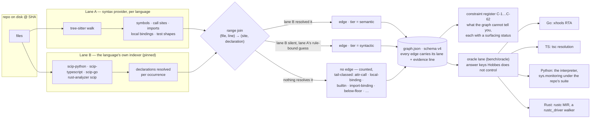
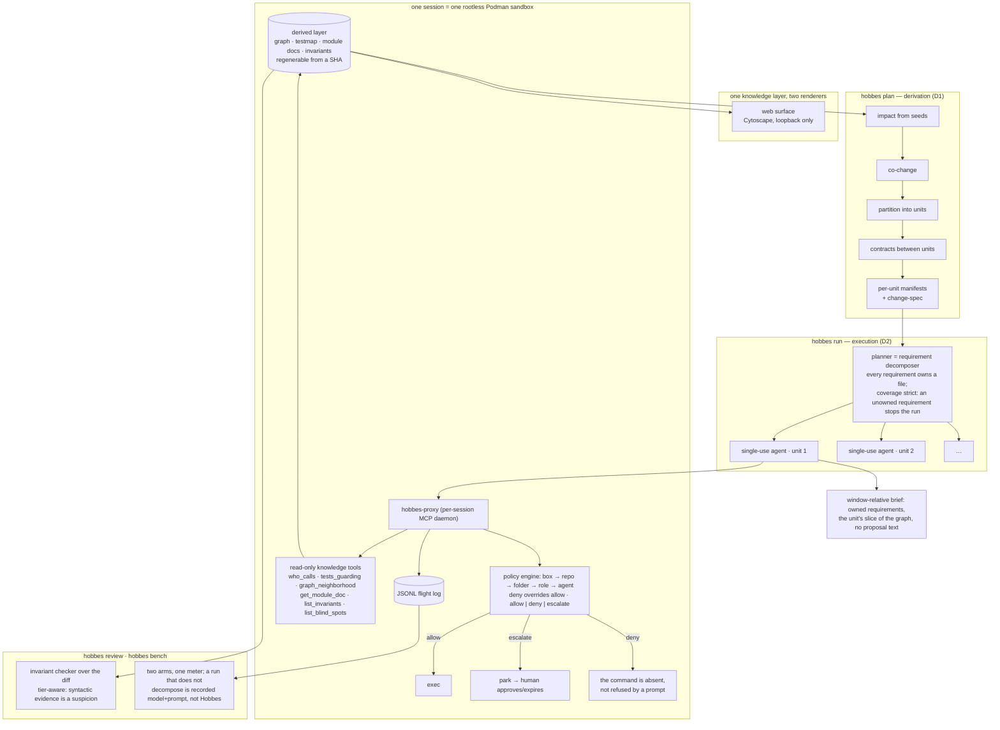

# How Hobbes differs — from CodeGraphContext, repowise, and the "code graph for agents" shape

**Written 2026-08-25 (Max); corrected the same day** — the first draft
compared against a different project called CodeGraph
(`codegraph-ai/CodeGraph`); the one meant is
**[CodeGraphContext](https://github.com/CodeGraphContext/CodeGraphContext)**
("an MCP server plus a CLI tool that indexes local code into a graph
database to provide context to AI assistants"), and this page now reads
from its README. Two projects read, at headline level, like Hobbes:
CodeGraphContext and
[repowise](https://github.com/repowise-dev/repowise) ("codebase
intelligence for AI and humans … via MCP"). The one-line descriptions
collide — a graph, MCP tools, deterministic, for agents — and repowise's
README even shares vocabulary with this repo's ("confidence-stamped",
"compiler-graded cells"). **Hobbes was built independently of both**; its
history is `docs/BUILDLOG.md`, one dated entry per session from the first
commit, and every design choice has an ADR. The structure is where the
difference is loud, so this page shows the structure. What the other two
do is taken from their own READMEs at the date above and nothing more is
claimed about them.

## 1. The extraction layer

What the picture says that a headline cannot:

- **Two lanes, one join.** Every language is a syntax provider *and* a
  pinned SCIP indexer meeting in one evidence IR. The semantic edge comes
  from the language's own toolchain resolving the occurrence, not from a
  heuristic scored by how far the name had to travel. CodeGraphContext
  is tree-sitter by default across 23 languages, with SCIP as an
  *optional* enhancement (`SCIP_INDEXER=true`) for C/C++/C# — the two
  are alternatives that feed one graph database (FalkorDB by default,
  KuzuDB/Neo4j as backends), and an edge does not say which produced
  it; repowise is tree-sitter with a resolution ladder whose confidence
  is a number (0.95 same-file … 0.50 repo-wide name match). In Hobbes
  lane B is mandatory for every supported language and is the
  language's own indexer *pinned by version* (ADR-027), the join is one
  range join with no database, and the artifact is a JSON file
  regenerable from a SHA. In Hobbes a **tier is which lane proved the edge**, not a
  probability — and the syntactic tier is priced by the oracle (0/3 Go,
  6/6 Python, 12/30 Rust wrong before the fixes; the wrong shapes are
  now vetoed) rather than estimated.
- **The tail is counted, not smoothed.** A site nothing resolves is not
  an edge (ADR-007) and is classified by observation only — including
  `below-floor`, the sites the semantic lane resolved to a declaration
  the graph keeps no symbol for (closures, interface methods), so the
  known hole is named per file.
- **The register is a first-class artifact.** Sixty-two entries of what
  the graph cannot tell you, each with where a user meets the limit
  (surfaced / partial / unsurfaced), amended in the same commit as the
  code. Inherited indexer limits are owned as Hobbes' own.
- **The oracle lane grades against something Hobbes does not control**,
  per language, with pre-registered predictions, per-cell records, a
  miss register by class, a defect record for the harness's own errors
  (H-1…H-16 — most were false verdicts *against* Hobbes caught by
  fixtures), and a poison check on every cell (seeded wrong edges; 0
  falsely confirmed). Precision is never quoted without recall, recall
  never without its root count or coverage line, and a Python number is
  a trace number (confirm-only), never precision. CodeGraphContext's
  README states no accuracy, precision or confidence figure.

### The numbers, per cell (2026-08-25; `docs/oracle-cells/`)

| cell | oracle | Hobbes edges | semantic tier | syntactic tier | recall |
|---|---|---|---|---|---|
| this repo, Go | RTA, 20 roots | 1,282 | **1,278/1,278** | 0/3 | 87.5% (static calls 1,280/1,280) |
| dagger, 19 Go modules | RTA, 24 roots | 10,507 | **9,851/9,851** | — | 9,890/10,715 (static named 9,889/9,889) |
| kbet, TS | tsc | 630 | **626/626** | 4/4 | 633/637 on declared callees; 41.4% over every resolved site |
| this repo, Python | the interpreter, its own suite | 3,495 | **3,302 confirmed, 0 wrong on the executed slice**, 4 suspect (not-exercised) | 0 executed | recall-against-executed 86.3%, 96.9% on named declarations |
| rust_proj | rustc MIR | 17 | **17/17** | — | 17/21 |
| dagger `sdk/rust` | rustc MIR, 15 targets | 3,598 | **3,592/3,592** | 0/0 after ADR-090 | 98.1% |

Every miss on every language is one class, C-58: closures, function
values, interface / extension-trait dispatch (70–81% of misses), plus
Rust's macro- and derive-written code. Neither compared project
publishes a per-cell precision *and* recall against an independent
answer key; repowise publishes a hand-graded 84.8% precision figure over
seven cells, CodeGraphContext publishes none.

## 2. Context supply to agents

What the picture says:

- **Context is derived, not served à la carte.** CodeGraphContext and
  repowise hand an agent a query surface — a graph database behind an
  MCP server answering "who calls this, what does this connect to,
  dead code, complexity" (CodeGraphContext, kept live by `cgc watch`),
  ten task-shaped tools (repowise) — and the agent pulls what it thinks
  it needs. Hobbes derives the context *for a task*:
  the plan partitions the change into units with contracts, the planner
  decomposes requirements with an owning file each, and each
  **single-use agent** gets a window-relative brief holding its slice
  and nothing else. The six knowledge tools exist, but they are
  read-only and secondary; `list_blind_spots` is the one every session
  is told to read first, because it names what the graph cannot see
  there.
- **Policy is enforced below the model.** A session runs in a rootless
  Podman sandbox behind a per-session MCP proxy with a Go policy engine
  (box → repo → folder → role → agent; deny overrides allow; allow /
  deny / escalate to a human queue). A forbidden command is *absent*,
  and every call is in a flight log. repowise governs by hooks that push
  context and intercept tool calls; CodeGraphContext's README does not
  discuss governing agent actions. Neither sandboxes.
- **A specific guarantee outranks the general system** (P10): the
  read-before-edit ticket, the write scope at the cut, the repeat
  guard — each keeps its own test at the level a user meets it.
- **The benchmark is honest about what it measures.** A Hobbes test
  decomposes or it is not a Hobbes test (P12): an aided run that does
  not go through the planner is recorded `arm=model+prompt` by the
  machinery itself. The result register so far is 0/5 solved on the 7B
  validation pair, eight harness defects filed, no H1 claim earned —
  written down, not rounded up.
- **Hobbes stays local and does not do health scores, wiki generation,
  git archaeology, a graph database or live file watching.** Those are
  repowise's layers and CodeGraphContext's storage and `watch` mode;
  Hobbes re-derives from a commit SHA instead, and they are not goals
  here (ADR-033 §10).

## 3. Where the three agree

All three parse with tree-sitter somewhere, build without LLM calls,
speak MCP, and want agents to move from "where is this defined" to
"how does this connect" (CodeGraphContext's phrase) without grepping.
Hobbes and CodeGraphContext both run SCIP indexers — the difference is
that Hobbes makes them mandatory, pinned, and joined against the syntax
lane with the tier recording which one spoke. That shared surface is the
whole reason this page exists.
