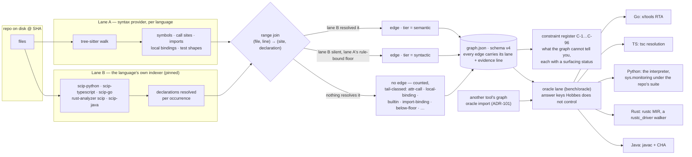
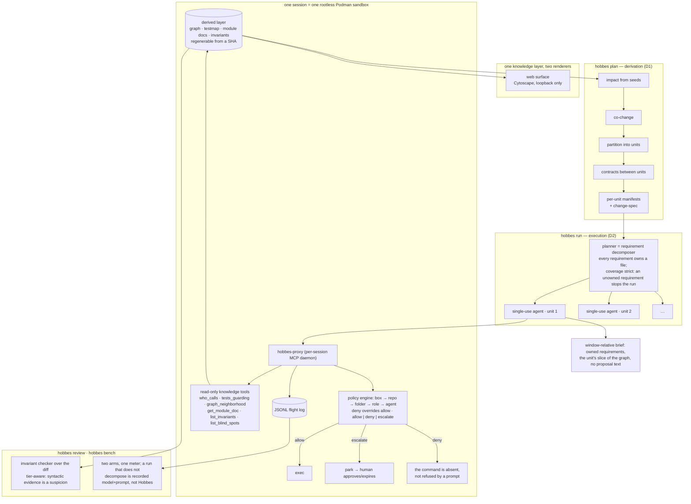

# How Hobbes differs — from CodeGraphContext, repowise, and the "code graph for agents" shape

**Written 2026-08-25 (Max); corrected the same day; rewritten 2026-09-09
to point at the cells instead of restating them (ADR-101).** Two
projects read, at headline level, like Hobbes:
**[CodeGraphContext](https://github.com/CodeGraphContext/CodeGraphContext)**
("an MCP server plus a CLI tool that indexes local code into a graph
database to provide context to AI assistants") and
[repowise](https://github.com/repowise-dev/repowise) ("codebase
intelligence for AI and humans … via MCP"). The one-line descriptions
collide — a graph, MCP tools, deterministic, for agents — and
repowise's README shares vocabulary with this repo's
("confidence-stamped", "compiler-graded cells"). **Hobbes was built
independently of both**; its history is `docs/BUILDLOG.md`, one dated
entry per session from the first commit, and every design choice has
an ADR. The structure is where the difference is loud, so this page
shows the structure. What the other projects do is taken from their
own READMEs — one row per tool, every cell sourced or *unstated*, in
[`comparative/field.md`](comparative/field.md) — and nothing more is
claimed about them.

**The numbers are not on this page.** They live in one place, the
cell records (`docs/oracle/cells/`), and the comparison is the cells
made by putting other tools' graphs through the same compiler answer
keys on the same repos at the same commits
([`comparative/README.md`](comparative/README.md) and its generated
[`tables.md`](comparative/tables.md)). A number quoted here would be a
second copy that drifts; a number a tool publishes on another basis
is in `field.md` §3 with that basis, beside nothing.

## 1. The extraction layer

What the picture says that a headline cannot:

- **Two lanes, one join.** Every language is a syntax provider *and* a
  pinned SCIP indexer meeting in one evidence IR. The semantic edge
  comes from the language's own toolchain resolving the occurrence, not
  from a heuristic scored by how far the name had to travel.
  CodeGraphContext is tree-sitter across its languages with SCIP as an
  *optional* enhancement for C/C++/C#, feeding one graph database in
  which an edge carries a confidence label (EXTRACTED / INFERRED) and a
  separate table holds name-only guesses; repowise is tree-sitter with
  a resolution ladder whose confidence is a number (0.95 same-file …
  0.50 repo-wide) and a `resolution_origin` per edge. In Hobbes lane B
  is mandatory for every supported language and is the language's own
  indexer *pinned by version* (ADR-027), the join is one range join
  with no database, and the artifact is a JSON file regenerable from a
  SHA. A **tier is which lane proved the edge**, not a probability —
  and the syntactic tier's wrong shapes were priced by the oracle and
  vetoed (ADR-090) rather than estimated.
- **The tail is counted, not smoothed.** A site nothing resolves is not
  an edge (ADR-007) and is classified by observation only — including
  `below-floor`, the sites the semantic lane resolved to a declaration
  the graph keeps no symbol for (closures, interface methods), so the
  known hole is named per file. That per-directory view is what named
  the date-fns fix; the before/after is
  [`comparative/graphics/date-fns-before-after.svg`](comparative/graphics/date-fns-before-after.svg).
- **The register is a first-class artifact.** Ninety-six entries of
  what the graph cannot tell you, each with where a user meets the
  limit (surfaced / partial / unsurfaced), amended in the same commit
  as the code. Inherited indexer limits are owned as Hobbes' own (P9);
  a competitor's edge our conversion misreads is owned the same way,
  pointed the other way (C-94).
- **The oracle lane grades against something Hobbes does not control**,
  per language, with pre-registered predictions, per-cell records, a
  miss register by class, a defect record for the harness's own errors
  (most were false verdicts *against* Hobbes caught by fixtures), and a
  poison check on every cell (seeded wrong edges; 0 falsely confirmed).
  Precision is never quoted without recall, recall never without its
  root count or coverage line, and a Python number is a trace number
  (confirm-only), never precision. **And the lane does not care who
  produced the edges**: since 2026-09-09 a third-party graph goes
  through `oracle import` and the same matcher and poison check
  (ADR-101), so the comparison with CodeGraphContext and repowise is
  the same repos, the same commits, the same keys — not their numbers
  beside ours. What each publishes on its own basis — repowise a
  hand-graded precision and, since September, a compiler-graded table
  of its own on other repos; CodeGraphContext none — is recorded in
  [`comparative/field.md`](comparative/field.md) §3 and compared
  nowhere.

## 2. Context supply to agents

What the picture says:

- **Context is derived, not served à la carte.** CodeGraphContext and
  repowise hand an agent a query surface — a graph database behind an
  MCP server answering "who calls this, what does this connect to,
  dead code, complexity" (CodeGraphContext, kept live by its watch
  mode), ten task-shaped tools plus agent hooks (repowise) — and the
  agent pulls what it thinks it needs. Hobbes derives the context *for
  a task*: the plan partitions the change into units with contracts,
  the planner decomposes requirements with an owning file each, and
  each **single-use agent** gets a window-relative brief holding its
  slice and nothing else. The six knowledge tools exist, but they are
  read-only and secondary; `list_blind_spots` is the one every session
  is told to read first, because it names what the graph cannot see
  there.
- **Policy is enforced below the model.** A session runs in a rootless
  Podman sandbox behind a per-session MCP proxy with a Go policy engine
  (box → repo → folder → role → agent; deny overrides allow; allow /
  deny / escalate to a human queue). A forbidden command is *absent*,
  and every call is in a flight log. repowise governs by hooks that
  push context and intercept tool calls; CodeGraphContext's README does
  not discuss governing agent actions. Neither sandboxes; neither runs
  its own indexer in one (Hobbes runs every lane B step and every
  executing oracle in the sandbox image, ADR-092 — which is also why a
  competitor cell is marked host-run, C-96).
- **A specific guarantee outranks the general system** (P10): the
  read-before-edit ticket, the write scope at the cut, the repeat
  guard — each keeps its own test at the level a user meets it.
- **The benchmark is honest about what it measures.** A Hobbes test
  decomposes or it is not a Hobbes test (P12): an aided run that does
  not go through the planner is recorded `arm=model+prompt` by the
  machinery itself. No H1 claim has been earned, and none is made on
  the comparative pages either (ADR-101 §7).
- **Hobbes stays local and does not do health scores, wiki generation,
  git archaeology, a graph database or live file watching.** Those are
  repowise's layers and CodeGraphContext's storage and watch mode;
  Hobbes re-derives from a commit SHA instead, and they are not goals
  here (ADR-033 §10).

## 3. Where the three agree

All three parse with tree-sitter somewhere, build without LLM calls,
speak MCP, and want agents to move from "where is this defined" to
"how does this connect" (CodeGraphContext's phrase) without grepping.
Hobbes and CodeGraphContext both run SCIP indexers — the difference is
that Hobbes makes them mandatory, pinned, and joined against the syntax
lane with the tier recording which one spoke. And since September 2026
repowise and Hobbes agree on the *method* of measurement — a compiler's
own call graph as the key, precision and recall as a pair, recall never
compared across cells, a contradiction as evidence not proof — which is
why their graphs can be put through each other's keys at all. That
shared surface is the whole reason this page exists.
